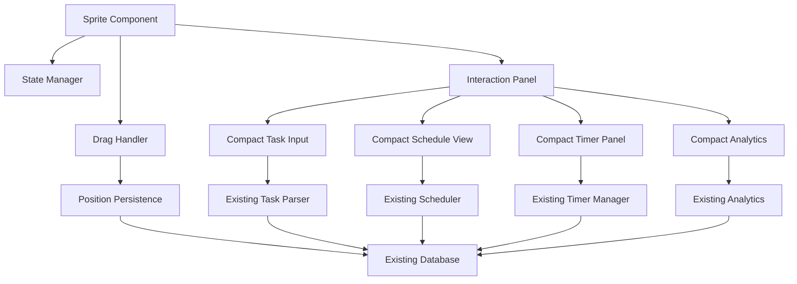

# Design Document

## Overview

This design transforms the Clippy task scheduler from a full-page web application into an authentic Clippy-style sprite assistant. The sprite will be aggable, interactive character that floats above page content, providing access to all task management functionality through compact overlay panels. The design prioritizes reusing all existing business logic (task parser, scheduler, timer manager, persistence, analytics, notifications) while creating a new presentation layer focused on the sprite interaction model.

The sprite interface consists of three main components:
1. **Sprite Component**: The draggable character visual with state-based animations
2. **Interaction Panel**: A popup overlay containing compact versions of existing UI components
3. **Position Manager**: Handles drag behavior, position persistence, and viewport constraints

## Architecture

### High-Level Architecture



### Component Responsibilities

- **Sprite Component**: Renders the Clippy character, handles click/drag events, manages visual states
- **Drag Handler**: Implements drag-and-drop behavior with viewport boundary constraints
- **Position Manager**: Persists and restores sprite coordinates
- **Interaction Panel**: Container for compact UI elements, handles open/close state and positioning
- **Compact UI Components**: Condensed versions of TaskInput, ScheduleView, TimerPanel, AnalyticsPanel
- **State Manager**: Tracks sprite visual state (idle, active, celebrating, thinking)
- **Existing Modules**: All business logic remains unchanged (parser, scheduler, timer, storage, analytics, notifications)

### Technology Stack

- **Framework**: React 18 (existing)
- **Language**: TypeScript (existing)
- **Styling**: Tailwind CSS (existing) + custom CSS for sprite animations
- **Drag & Drop**: React hooks with native mouse/touch events
- **Sprite Visual**: SVG or animated GIF/PNG sprite sheet
- **Storage**: IndexedDB via existing database module
- **Testing**: Vitest + fast-check (existing)

## Components and Interfaces

### Core Types

```typescript
// Sprite position coordinates
interface SpritePosition {
  x: number; // pixels from left edge
  y: number; // pixels from top edge
}

// Sprite visual states
type SpriteState = 'idle' | 'active' | 'celebrating' | 'thinking';

// Interaction panel state
interface PanelState {
  isOpen: boolean;
  activeView: 'tasks' | 'schedule' | 'timer' | 'analytics';
}

// Drag state
interface DragState {
  isDragging: boolean;
  startX: number;
  startY: number;
  offsetX: number;
  offsetY: number;
}
```

### Sprite Component Interface

```typescript
interface SpriteComponentProps {
  position: SpritePosition;
  state: SpriteState;
  hasActiveSession: boolean;
  onPositionChange: (position: SpritePosition) => void;
  onClick: () => void;
}

interface SpriteComponent {
  render(): JSX.Element;
}
```

The sprite component:
- Renders a visual character (100-150px)
- Shows different animations/images based on state
- Displays a small indicator when a timer is active
- Handles both click and drag interactions
- Applies CSS transforms for smooth positioning

### Drag Handler Interface

```typescript
interface DragHandlerProps {
  initialPosition: SpritePosition;
  onDragStart: () => void;
  onDragMove: (position: SpritePosition) => void;
  onDragEnd: (position: SpritePosition) => void;
}

interface DragHandler {
  handleMouseDown(event: React.MouseEvent): void;
  handleMouseMove(event: MouseEvent): void;
  handleMouseUp(event: MouseEvent): void;
  handleTouchStart(event: React.TouchEvent): void;
  handleTouchMove(event: TouchEvent): void;
  handleTouchEnd(event: TouchEvent): void;
}
```

The drag handler:
- Distinguishes between click and drag (drag threshold: 5px movement)
- Constrains sprite position to viewport boundaries
- Supports both mouse and touch events
- Provides smooth dragging with requestAnimationFrame

### Interaction Panel Interface

```typescript
interface InteractionPanelProps {
  isOpen: boolean;
  spritePosition: SpritePosition;
  activeView: 'tasks' | 'schedule' | 'timer' | 'analytics';
  onClose: () => void;
  onViewChange: (view: string) => void;
}

interface InteractionPanel {
  render(): JSX.Element;
  calculatePosition(spritePos: SpritePosition): { x: number; y: number };
}
```

The interaction panel:
- Appears near the sprite (offset by 20-30px)
- Sizes approximately 300-400px wide, variable height
- Contains tabbed navigation for different views
- Positions intelligently to avoid screen edges
- Closes on outside click or close button
- Animates in/out with CSS transitions

### Position Manager Interface

```typescript
interface PositionManager {
  savePosition(position: SpritePosition): Promise<void>;
  loadPosition(): Promise<SpritePosition | null>;
  getDefaultPosition(): SpritePosition;
  constrainToViewport(position: SpritePosition, spriteSize: { width: number; height: number }): SpritePosition;
}
```

The position manager:
- Saves position to IndexedDB under appState store
- Loads position on app mount
- Returns default position (bottom-right: { x: window.innerWidth - 180, y: window.innerHeight - 180 })
- Constrains positions to keep sprite fully visible

### Compact UI Components

All compact components reuse existing business logic but with condensed layouts:

```typescript
// Compact Task Input - same parser, smaller UI
interface CompactTaskInputProps {
  onTaskAdded: (tasks: Task[]) => void;
}

// Compact Schedule View - scrollable list, smaller blocks
interface CompactScheduleViewProps {
  scheduleBlocks: ScheduleBlock[];
  tasks: Task[];
  onStartSession: (blockId: string, taskId: string) => void;
  maxHeight?: number; // e.g., 300px for scrolling
}

// Compact Timer Panel - same timer manager, condensed display
interface CompactTimerPanelProps {
  timerManager: TimerManager;
  tasks: Task[];
  onSessionUpdate: () => void;
}

// Compact Analytics - same calculations, smaller cards
interface CompactAnalyticsPanelProps {
  // Uses existing analytics functions
}
```

## Data Models

### Sprite Position Storage

The sprite position is stored in the existing `appState` object store:

```typescript
// Key: 'spritePosition'
// Value: { x: number, y: number }
```

### Panel State Storage

The last active panel view is stored in `appState`:

```typescript
// Key: 'lastPanelView'
// Value: 'tasks' | 'schedule' | 'timer' | 'analytics'
```

### Sprite State Determination

The sprite visual state is derived from application state:

```typescript
function determineSpriteState(
  hasActiveSession: boolean,
  isGeneratingSchedule: boolean,
  recentlyCompletedTask: boolean
): SpriteState {
  if (recentlyCompletedTask) return 'celebrating';
  if (isGeneratingSchedule) return 'thinking';
  if (hasActiveSession) return 'active';
  return 'idle';
}
```

### Drag Behavior State Machine

```
[idle] --mousedown--> [potential_drag] --move > threshold--> [dragging] --mouseup--> [idle]
                                      --move < threshold + mouseup--> [clicked] --> [idle]
```

## Data Models

### Viewport Constraint Algorithm

```typescript
function constrainToViewport(
  position: SpritePosition,
  spriteSize: { width: number; height: number }
): SpritePosition {
  const maxX = window.innerWidth - spriteSize.width;
  const maxY = window.innerHeight - spriteSize.height;
  
  return {
    x: Math.max(0, Math.min(position.x, maxX)),
    y: Math.max(0, Math.min(position.y, maxY))
  };
}
```

### Panel Positioning Algorithm

```typescript
function calculatePanelPosition(
  spritePos: SpritePosition,
  panelSize: { width: number; height: number }
): { x: number; y: number } {
  // Try to position panel to the right of sprite
  let x = spritePos.x + 150 + 20; // sprite width + offset
  let y = spritePos.y;
  
  // If panel would overflow right edge, position to the left
  if (x + panelSize.width > window.innerWidth) {
    x = spritePos.x - panelSize.width - 20;
  }
  
  // If panel would overflow bottom edge, adjust upward
  if (y + panelSize.height > window.innerHeight) {
    y = window.innerHeight - panelSize.height - 20;
  }
  
  // Ensure panel doesn't go off top or left edges
  x = Math.max(20, x);
  y = Math.max(20, y);
  
  return { x, y };
}
```


## Correctness Properties

*A property is a characteristic or behavior that should hold true across all valid executions of a system—essentially, a formal statement about what the system should do. Properties serve as the bridge between human-readable specifications and machine-verifiable correctness guarantees.*

### Property Reflection

After analyzing all acceptance criteria, several properties were identified as redundant or overlapping:

- **Position persistence (1.4, 9.1, 9.2)**: These all test the same round-trip behavior for sprite position
- **Notification integration (11.1, 11.2, 11.3, 11.5)**: Already covered by existing tests from the original spec
- **Session restoration (9.5)**: Already covered by existing tests from the original spec
- **Module reuse (12.1-12.5)**: Can be combined into a single property verifying all modules are reused

The following properties represent the unique, non-redundant correctness guarantees for the sprite interface:

### Property 1: Position persistence round-trip

*For any* valid sprite position, saving it to storage and then loading it should produce the same coordinates.
**Validates: Requirements 1.4, 2.4, 9.1, 9.2**

### Property 2: Viewport boundary constraints

*For any* attempted sprite position (including those outside viewport bounds), the constrained position should keep the sprite fully visible within the viewport.
**Validates: Requirements 2.5**

### Property 3: Drag position updates

*For any* sequence of cursor movements during a drag operation, the sprite position should update to match the cursor position (minus the initial offset).
**Validates: Requirements 2.1, 2.2**

### Property 4: Drag completion preserves position

*For any* drag operation, after releasing the mouse button, the sprite should remain at the final drag position.
**Validates: Requirements 2.3**

### Property 5: Click without drag opens panel

*For any* mouse interaction where the cursor moves less than the drag threshold (5px), releasing the button should open the interaction panel.
**Validates: Requirements 3.1**

### Property 6: Panel closes and resets sprite state

*For any* open panel state, closing the panel should hide it and return the sprite to an appropriate state based on current session status.
**Validates: Requirements 3.4**

### Property 7: Panel positioning avoids viewport edges

*For any* sprite position, the calculated panel position should keep the entire panel within viewport boundaries.
**Validates: Requirements 3.5**

### Property 8: Compact UI uses existing parser

*For any* task input string, the compact task input should produce the same parse result as the original task input component.
**Validates: Requirements 4.1, 4.2**

### Property 9: Task addition provides feedback

*For any* successful task addition, either the sprite state should change or the panel content should update to reflect the new task.
**Validates: Requirements 4.3**

### Property 10: Parse errors display in panel

*For any* invalid task input, an error message should appear within the interaction panel.
**Validates: Requirements 4.4**

### Property 11: Task persistence through compact UI

*For any* task added through the compact UI, it should be persisted to storage and retrievable.
**Validates: Requirements 4.5**

### Property 12: Schedule blocks contain required information

*For any* schedule block displayed in the compact schedule view, the rendered output should include start time, task name, and a start button.
**Validates: Requirements 5.3**

### Property 13: Timer integration with existing manager

*For any* start button click in the compact schedule view, a session should be created using the existing timer manager with correct task and block IDs.
**Validates: Requirements 5.4**

### Property 14: Active session displays timer panel

*For any* active timebox session, when the interaction panel is open, the timer panel should be visible.
**Validates: Requirements 6.1**

### Property 15: Timer displays accurate elapsed time

*For any* running timer, the displayed elapsed time should match the actual time calculated by the timer manager.
**Validates: Requirements 6.2**

### Property 16: Active session shows sprite indicator

*For any* active session when the panel is closed, the sprite should display a visual indicator (e.g., badge, icon, or state change).
**Validates: Requirements 6.5**

### Property 17: Analytics data updates in real-time

*For any* change to completed tasks or sessions, the analytics display should update to reflect the new values.
**Validates: Requirements 7.4**

### Property 18: Analytics uses existing calculations

*For any* analytics data displayed in the compact UI, the values should match those calculated by the existing analytics functions.
**Validates: Requirements 7.5**

### Property 19: Sprite state reflects session status

*For any* active timebox session, the sprite should display the 'active' state.
**Validates: Requirements 8.2**

### Property 20: Task completion triggers celebration

*For any* task completion event, the sprite should briefly display the 'celebrating' state.
**Validates: Requirements 8.3**

### Property 21: Schedule generation shows thinking state

*For any* schedule generation operation, the sprite should display the 'thinking' state during processing.
**Validates: Requirements 8.4**

### Property 22: Last panel view persistence

*For any* panel view (tasks, schedule, timer, analytics), closing and reopening the panel should restore the last active view.
**Validates: Requirements 9.4**

### Property 23: Viewport resize constrains position

*For any* viewport resize event, if the sprite would be outside the new viewport bounds, its position should be adjusted to remain fully visible.
**Validates: Requirements 10.1**

### Property 24: Touch events support dragging

*For any* touch-based drag operation, the sprite should move following the touch point just as it does with mouse events.
**Validates: Requirements 10.3**

### Property 25: Notification triggers sprite animation

*For any* notification event (start, complete, overrun), the sprite should briefly animate or change state to draw attention.
**Validates: Requirements 11.4**

### Property 26: Existing modules are reused

*For any* operation in the sprite interface (parsing, scheduling, timing, persistence, analytics, notifications), the existing module functions should be called without modification.
**Validates: Requirements 12.1, 12.2, 12.3, 12.4, 12.5**

## Error Handling

### Sprite Positioning Errors

- **Invalid saved position**: If loaded position is corrupted or invalid, use default position (bottom-right)
- **Viewport too small**: If viewport is smaller than sprite, position at (0, 0) and log warning
- **Position constraint failure**: If constraint algorithm fails, fall back to default position

### Drag Handler Errors

- **Event listener failure**: Log error and disable dragging, sprite remains clickable
- **Touch event conflicts**: Prevent default on touch events to avoid scroll conflicts
- **Rapid state changes**: Debounce drag state updates to prevent race conditions

### Panel Positioning Errors

- **Panel overflow**: If panel cannot fit in viewport, reduce panel size or show scrollable content
- **Position calculation failure**: Fall back to centering panel in viewport
- **Z-index conflicts**: Ensure panel z-index is higher than sprite (sprite: 9999, panel: 10000)

### Compact UI Errors

- **Component render failure**: Show error boundary with message "Unable to load this view"
- **Data loading failure**: Display error message in panel, allow retry
- **Storage errors**: Use existing error handling from database module

### State Management Errors

- **Invalid state transition**: Log warning and maintain current state
- **State persistence failure**: Continue with in-memory state, show warning banner
- **State restoration failure**: Start with default state (idle, panel closed)

## Testing Strategy

### Dual Testing Approach

This project uses both unit testing and property-based testing to ensure comprehensive coverage:

- **Unit tests** verify specific examples, edge cases, and error conditions
- **Property tests** verify universal properties that should hold across all inputs
- Together they provide comprehensive coverage: unit tests catch concrete bugs, property tests verify general correctness

### Unit Testing

Unit tests will be written using Vitest and will cover:

- **Specific examples**: Sprite renders at default position, panel opens on click, specific state transitions
- **Edge cases**: Empty schedule display, no saved position, viewport smaller than sprite
- **Error conditions**: Invalid position data, storage failures, event listener failures
- **Integration points**: Compact UI components call existing modules correctly

Unit tests are helpful for catching specific bugs but should be kept focused. Property-based tests will handle covering many input variations.

### Property-Based Testing

**Library**: fast-check (JavaScript/TypeScript property-based testing library)

**Configuration**: Each property-based test will run a minimum of 100 iterations to ensure thorough random testing.

**Tagging Convention**: Each property-based test MUST include a comment tag in this exact format:
```typescript
// Feature: clippy-sprite-interface, Property 1: Position persistence round-trip
```

**Implementation Requirements**:
- Each correctness property listed in this design document MUST be implemented by a SINGLE property-based test
- Tests will use fast-check's generators (fc.integer(), fc.record(), fc.array(), etc.) to create random test data
- Custom generators will be created for sprite positions, drag sequences, and viewport dimensions
- Properties will use fc.assert() to verify invariants hold across all generated inputs

**Property Test Coverage**:

1. **Position properties**: Generate random positions and viewport sizes, verify constraints and persistence
2. **Drag properties**: Generate random drag sequences, verify position updates and completion
3. **Panel properties**: Generate random sprite positions, verify panel positioning and state management
4. **Integration properties**: Generate random tasks/schedules/sessions, verify compact UI uses existing modules
5. **State properties**: Generate random application states, verify sprite visual state is correct
6. **Responsive properties**: Generate random viewport sizes and touch events, verify behavior

### Test Organization

```
/src/components
  ClippySprite.test.tsx          # Unit tests for sprite component
  ClippySprite.property.test.tsx # Property tests for sprite behavior
  InteractionPanel.test.tsx      # Unit tests for panel component
  InteractionPanel.property.test.tsx # Property tests for panel behavior
  DragHandler.test.tsx           # Unit tests for drag behavior
  DragHandler.property.test.tsx  # Property tests for drag behavior
  CompactTaskInput.test.tsx      # Unit tests for compact input
  CompactScheduleView.test.tsx   # Unit tests for compact schedule
  CompactTimerPanel.test.tsx     # Unit tests for compact timer
  CompactAnalytics.test.tsx      # Unit tests for compact analytics

/src/lib
  spritePosition.test.ts         # Unit tests for position manager
  spritePosition.property.test.ts # Property tests for position persistence
  spriteState.test.ts            # Unit tests for state determination
```

## Implementation Notes

### Phase 1: Core Sprite Infrastructure

1. Create sprite component with basic rendering
2. Implement drag handler with mouse and touch support
3. Implement position manager with persistence
4. Add viewport constraint logic
5. Create interaction panel container with open/close behavior

### Phase 2: Compact UI Components

1. Create compact task input (reuse existing parser)
2. Create compact schedule view (reuse existing scheduler)
3. Create compact timer panel (reuse existing timer manager)
4. Create compact analytics panel (reuse existing analytics)
5. Add tab navigation between views

### Phase 3: State Management and Visual Feedback

1. Implement sprite state determination logic
2. Add sprite visual states (idle, active, celebrating, thinking)
3. Add active session indicator on sprite
4. Implement panel view persistence
5. Add notification-triggered animations

### Phase 4: Responsive and Polish

1. Add viewport resize handling
2. Implement intelligent panel positioning
3. Add smooth animations and transitions
4. Test on various screen sizes
5. Add accessibility features (keyboard navigation, ARIA labels)

### Development Priorities

1. **Reuse existing logic**: All business logic modules must remain unchanged
2. **Progressive enhancement**: Start with basic sprite, add features incrementally
3. **Mobile-first**: Ensure touch support works from the beginning
4. **Performance**: Use CSS transforms for positioning (GPU-accelerated)
5. **Accessibility**: Maintain keyboard navigation and screen reader support

### Key Design Decisions

**Why CSS transforms for positioning?**
- GPU-accelerated, smoother animations
- Better performance than changing top/left properties
- Easier to animate with CSS transitions

**Why single interaction panel instead of multiple?**
- Simpler state management
- Consistent user experience
- Easier to position and animate
- Reduces DOM complexity

**Why tabbed navigation in panel?**
- Familiar UI pattern
- Compact space usage
- Easy to add new views in future
- Clear visual hierarchy

**Why persist last panel view?**
- Better user experience (remembers context)
- Reduces clicks to access frequently used views
- Aligns with Clippy's "helpful assistant" persona

**Why separate compact components instead of responsive original components?**
- Cleaner separation of concerns
- Easier to optimize for small space
- Avoids complex responsive logic in original components
- Allows different interaction patterns (e.g., scrolling vs. pagination)

## Future Considerations

### Sprite Customization

- Multiple sprite character options (Clippy, Rover, Merlin, etc.)
- User-uploaded custom sprites
- Sprite animation library for richer expressions
- Voice/sound effects for state changes

### Advanced Interactions

- Drag-to-schedule: Drag tasks from panel onto schedule
- Sprite follows cursor when giving suggestions
- Contextual tips based on user behavior
- Gesture support (swipe to change views)

### Multi-Monitor Support

- Remember sprite position per monitor
- Detect monitor changes and adjust position
- Allow sprite to move between monitors

### Performance Optimization

- Lazy load panel views (only render active view)
- Virtual scrolling for long schedule lists
- Memoize expensive calculations
- Use Web Workers for heavy processing

### Accessibility Enhancements

- High contrast sprite variants
- Reduced motion mode (disable animations)
- Screen reader announcements for state changes
- Keyboard shortcuts for all sprite interactions
- Focus trap in interaction panel
