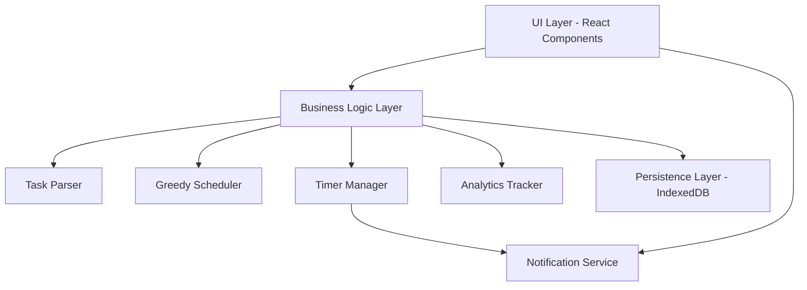

# Design Document

## Overview

Clippy is a React-based web application that provides intelligent task scheduling and time tracking. The system follows a modular architecture with clear paration between parsing, scheduling, storage, and presentation layers. The application uses a greedy scheduling algorithm to automatically fit tasks into available time slots, supports interactive timebox sessions with pause/resume capabilities, and persists all state locally using IndexedDB.

The design prioritizes simplicity, testability, and incremental development. Core functionality is implemented first, with scaffolding for future features (idle detection, clipboard helper, project automation, personality layer, calendar integration) prepared but not fully implemented.

## Architecture

### High-Level Architecture



### Component Responsibilities

- **UI Layer**: React components for task input, schedule display, timer panel, and analytics
- **Task Parser**: Converts user input (short notation or natural language) into structured task objects
- **Greedy Scheduler**: Assigns tasks to available time slots based on work hours and fixed events
- **Timer Manager**: Handles session lifecycle (start/pause/resume/finish) and time tracking
- **Persistence Layer**: IndexedDB wrapper for storing tasks, schedules, sessions, and analytics
- **Analytics Tracker**: Records user actions and system events
- **Notification Service**: Manages browser notifications for session events

### Technology Stack

- **Framework**: React 18 with Vite for fast development and HMR
- **Language**: TypeScript for type safety
- **Styling**: Tailwind CSS for rapid UI development
- **Storage**: IndexedDB via idb library for local persistence
- **Testing**: Vitest for unit tests (Jest-compatible API)
- **Notifications**: Web Notifications API
- **Linting**: ESLint + Prettier for code quality

## Components and Interfaces

### Core Types

```typescript
// Task representation
interface Task {
  id: string;
  name: string;
  durationMinutes: number;
  createdAt: Date;
  completed: boolean;
}

// Schedule block with time assignment
interface ScheduleBlock {
  id: string;
  taskId: string;
  startTime: Date;
  endTime: Date;
  status: 'scheduled' | 'in-progress' | 'completed';
}

// Timebox session tracking
interface Session {
  id: string;
  taskId: string;
  scheduleBlockId: string;
  startTime: Date;
  pausedAt?: Date;
  resumedAt?: Date;
  completedAt?: Date;
  accumulatedMinutes: number;
  status: 'active' | 'paused' | 'completed';
}

// User availability configuration
interface WorkHours {
  startHour: number; // 0-23
  startMinute: number; // 0-59
  endHour: number;
  endMinute: number;
}

// Fixed calendar event
interface FixedEvent {
  id: string;
  startTime: Date;
  endTime: Date;
  title: string;
}

// Analytics event
interface AnalyticsEvent {
  id: string;
  type: 'schedule_generated' | 'timebox_started' | 'timebox_paused' | 
        'timebox_resumed' | 'task_completed' | 'suggestion_accepted';
  timestamp: Date;
  metadata: Record<string, any>;
}
```

### Task Parser Interface

```typescript
interface ParseResult {
  tasks: Task[];
  errors: string[];
}

interface TaskParser {
  parse(input: string): ParseResult;
}
```

The parser supports two formats:
1. **Short notation**: `taskName(duration)` - e.g., "emails(20)"
2. **Natural language**: "Do X for Y minutes" - e.g., "Do emails for 20 minutes, then report for 90"

### Scheduler Interface

```typescript
interface ScheduleInput {
  tasks: Task[];
  workHours: WorkHours;
  fixedEvents: FixedEvent[];
  scheduleDate: Date;
}

interface ScheduleResult {
  scheduledBlocks: ScheduleBlock[];
  unscheduledTasks: Task[];
}

interface Scheduler {
  generateSchedule(input: ScheduleInput): ScheduleResult;
}
```

The greedy scheduler iterates through tasks in order and assigns each to the earliest available time slot that fits within work hours and doesn't conflict with fixed events.

### Timer Manager Interface

```typescript
interface TimerManager {
  startSession(taskId: string, scheduleBlockId: string): Session;
  pauseSession(sessionId: string): Session;
  resumeSession(sessionId: string): Session;
  finishSession(sessionId: string): Session;
  getActiveSession(): Session | null;
  getElapsedMinutes(sessionId: string): number;
}
```

### Persistence Interface

```typescript
interface Database {
  // Tasks
  addTask(task: Task): Promise<void>;
  getTasks(): Promise<Task[]>;
  updateTask(task: Task): Promise<void>;
  deleteTask(taskId: string): Promise<void>;
  
  // Schedule blocks
  addScheduleBlock(block: ScheduleBlock): Promise<void>;
  getScheduleBlocks(date: Date): Promise<ScheduleBlock[]>;
  updateScheduleBlock(block: ScheduleBlock): Promise<void>;
  clearScheduleBlocks(date: Date): Promise<void>;
  
  // Sessions
  addSession(session: Session): Promise<void>;
  getSession(sessionId: string): Promise<Session | null>;
  updateSession(session: Session): Promise<void>;
  getActiveSessions(): Promise<Session[]>;
  
  // Analytics
  addAnalyticsEvent(event: AnalyticsEvent): Promise<void>;
  getAnalyticsEvents(startDate: Date, endDate: Date): Promise<AnalyticsEvent[]>;
}
```

## Data Models

### Task Parser Data Flow

```
User Input → Parser → Validation → Task Objects → Storage
```

The parser uses regular expressions to match patterns:
- Short notation: `/(\w+)\((\d+)\)/g`
- Natural language: `/do\s+(.+?)\s+for\s+(\d+)\s+minutes?/gi`

### Scheduler Data Flow

```
Tasks + Work Hours + Fixed Events → Greedy Algorithm → Schedule Blocks → Storage
```

The greedy algorithm:
1. Sorts tasks by input order (FIFO)
2. Initializes current time to work hours start
3. For each task:
   - Find next available slot that fits duration
   - Skip over fixed events
   - If slot found before work hours end, create schedule block
   - Otherwise, add to unscheduled list
4. Returns scheduled blocks and unscheduled tasks

### Timer State Machine

```
[idle] --start--> [active] --pause--> [paused] --resume--> [active] --finish--> [completed]
```

Timer persistence ensures:
- Active sessions survive page reloads
- Accumulated time is preserved across pause/resume cycles
- Completion time is recorded for analytics

## Data Models

### IndexedDB Schema

**Object Stores:**

1. **tasks**
   - Key: `id` (string)
   - Indexes: `createdAt`, `completed`

2. **scheduleBlocks**
   - Key: `id` (string)
   - Indexes: `startTime`, `taskId`, `status`

3. **sessions**
   - Key: `id` (string)
   - Indexes: `taskId`, `status`, `startTime`

4. **analyticsEvents**
   - Key: `id` (string)
   - Indexes: `type`, `timestamp`

5. **appState**
   - Key: `key` (string)
   - Stores: work hours configuration, user preferences


## Correctness Properties

*A property is a charactistic or behavior that should hold true across all valid executions of a system—essentially, a formal statement about what the system should do. Properties serve as the bridge between human-readable specifications and machine-verifiable correctness guarantees.*

### Property 1: Parser extracts tasks correctly

*For any* valid input string in either short notation format "name(duration)" or natural language format "do X for Y minutes", parsing should produce task objects where each task's name and duration match the input values.
**Validates: Requirements 1.1, 1.2**

### Property 2: Parser rejects invalid durations

*For any* input with zero, negative, or non-numeric duration values, the parser should reject the input and return an error without creating a task.
**Validates: Requirements 1.3**

### Property 3: Parse errors preserve input

*For any* invalid input format, when parsing fails, the original input string should be preserved and an error message should be generated.
**Validates: Requirements 1.4**

### Property 4: Successful parse adds task and clears input

*For any* valid task input, after successful parsing, the task should appear in the task list and the input field should be empty.
**Validates: Requirements 1.5**

### Property 5: Scheduled blocks respect work hours

*For any* set of tasks and work hours configuration, all generated schedule blocks must have start and end times that fall within the defined work hours.
**Validates: Requirements 2.2**

### Property 6: Scheduled blocks avoid fixed events

*For any* schedule with fixed events, no schedule block should overlap with any fixed event time period.
**Validates: Requirements 2.3**

### Property 7: Unscheduled tasks are tracked

*For any* scheduling scenario where total task duration exceeds available time, all tasks that don't fit should appear in the unscheduled tasks list.
**Validates: Requirements 2.4**

### Property 8: Schedule blocks are chronologically ordered

*For any* generated schedule, the schedule blocks should be ordered by start time in ascending order.
**Validates: Requirements 2.5, 5.1**

### Property 9: Session state transitions are valid

*For any* session, the state transitions should follow the valid state machine: idle → active → paused → active → completed, and accumulated time should never decrease.
**Validates: Requirements 3.1, 3.2, 3.3, 3.4**

### Property 10: Task persistence round-trip

*For any* task object, storing it to the database and then retrieving it should produce an equivalent task with the same id, name, duration, and completion status.
**Validates: Requirements 4.1**

### Property 11: Schedule persistence round-trip

*For any* set of schedule blocks, storing them to the database and then retrieving them for the same date should produce equivalent schedule blocks.
**Validates: Requirements 4.2**

### Property 12: Session state persists across changes

*For any* session, after any state change (start, pause, resume, finish), retrieving the session from storage should reflect the updated state and accumulated time.
**Validates: Requirements 4.3, 4.5**

### Property 13: Application state restoration

*For any* application state with tasks, schedule blocks, and sessions, after simulating a reload by clearing memory and restoring from storage, all data should be equivalent to the pre-reload state.
**Validates: Requirements 4.4**

### Property 14: Schedule blocks contain required display information

*For any* schedule block, the rendered output should contain the task name, duration, start time, and a start button.
**Validates: Requirements 5.2**

### Property 15: Timer panel displays session information

*For any* active session, the timer panel should display the task name, elapsed time, and control buttons (pause/finish).
**Validates: Requirements 5.3**

### Property 16: Block status affects visual rendering

*For any* two schedule blocks with different statuses (scheduled vs in-progress vs completed), their rendered representations should have distinct visual styling.
**Validates: Requirements 5.5**

### Property 17: Session events trigger notifications

*For any* session start or completion, a notification should be sent with content that includes the task name.
**Validates: Requirements 6.1, 6.2**

### Property 18: Notification fallback on permission denial

*For any* notification attempt when permissions are denied, an in-app alert should be displayed instead of a browser notification.
**Validates: Requirements 6.5**

### Property 19: Analytics calculations are accurate

*For any* set of completed tasks and sessions, the displayed analytics should show the correct count of completed tasks and the correct sum of focus minutes.
**Validates: Requirements 7.1, 7.2**

### Property 20: Analytics events are recorded with complete data

*For any* user action (schedule generation, session start/pause/resume, task completion, suggestion acceptance), an analytics event should be recorded with the correct event type, timestamp, and all required metadata fields.
**Validates: Requirements 7.3, 7.4, 7.5, 8.1, 8.2, 8.3, 8.5**

### Property 21: Analytics events persist correctly

*For any* analytics event, storing it to the database and then retrieving it should produce an equivalent event with the same type, timestamp, and metadata.
**Validates: Requirements 8.4**

### Property 22: Messages use centralized strings

*For any* displayed message or microcopy, the text should match an entry in the centralized strings file (en.json).
**Validates: Requirements 9.3**

## Error Handling

### Parser Error Handling

- **Invalid format**: Return error with message "Unable to parse task. Use format: taskName(duration) or 'Do X for Y minutes'"
- **Invalid duration**: Return error with message "Duration must be a positive number"
- **Empty input**: Return error with message "Please enter a task"

### Scheduler Error Handling

- **No available time**: Return empty scheduled blocks and all tasks in unscheduled list
- **Invalid work hours**: Throw error "Work hours must have start time before end time"
- **Overlapping fixed events**: Log warning and continue scheduling around conflicts

### Timer Error Handling

- **Invalid state transition**: Throw error "Cannot [action] session in [current state]"
- **Session not found**: Throw error "Session not found"
- **Negative time**: Throw error "Accumulated time cannot be negative"

### Storage Error Handling

- **Database unavailable**: Fall back to in-memory storage and show warning banner
- **Quota exceeded**: Show error "Storage quota exceeded. Please clear old data."
- **Corrupted data**: Log error, skip corrupted record, continue with valid data

### Notification Error Handling

- **Permission denied**: Fall back to in-app alerts
- **Notification API unavailable**: Fall back to in-app alerts
- **Notification send failure**: Log error and continue

## Testing Strategy

### Dual Testing Approach

This project uses both unit testing and property-based testing to ensure comprehensive coverage:

- **Unit tests** verify specific examples, edge cases, and error conditions
- **Property tests** verify universal properties that should hold across all inputs
- Together they provide comprehensive coverage: unit tests catch concrete bugs, property tests verify general correctness

### Unit Testing

Unit tests will be written using Vitest and will cover:

- **Specific examples**: Concrete test cases that demonstrate correct behavior (e.g., parsing "emails(20)" produces a task with name "emails" and duration 20)
- **Edge cases**: Boundary conditions like empty inputs, zero durations, tasks at work hours boundaries
- **Error conditions**: Invalid inputs, storage failures, permission denials
- **Integration points**: Component interactions, storage operations, notification triggers

Unit tests are helpful for catching specific bugs but should be kept focused. Property-based tests will handle covering many input variations.

### Property-Based Testing

**Library**: fast-check (JavaScript/TypeScript property-based testing library)

**Configuration**: Each property-based test will run a minimum of 100 iterations to ensure thorough random testing.

**Tagging Convention**: Each property-based test MUST include a comment tag in this exact format:
```typescript
// Feature: clippy-task-scheduler, Property 1: Parser extracts tasks correctly
```

**Implementation Requirements**:
- Each correctness property listed in this design document MUST be implemented by a SINGLE property-based test
- Tests will use fast-check's generators (fc.string(), fc.integer(), fc.array(), etc.) to create random test data
- Custom generators will be created for domain objects (Task, ScheduleBlock, Session, etc.)
- Properties will use fc.assert() to verify invariants hold across all generated inputs

**Property Test Coverage**:

1. **Parser properties**: Generate random task names and durations, verify parsing correctness
2. **Scheduler properties**: Generate random tasks, work hours, and fixed events, verify scheduling constraints
3. **Session properties**: Generate random session state transitions, verify state machine correctness
4. **Persistence properties**: Generate random domain objects, verify round-trip consistency
5. **Analytics properties**: Generate random events and sessions, verify calculation accuracy
6. **UI properties**: Generate random data, verify rendering contains required elements

### Test Organization

```
/tests
  /unit
    parseTasks.test.ts
    scheduler.test.ts
    timer.test.ts
    storage.test.ts
    analytics.test.ts
  /property
    parser.property.test.ts
    scheduler.property.test.ts
    timer.property.test.ts
    persistence.property.test.ts
    analytics.property.test.ts
  /integration
    app.integration.test.ts
```

### Testing Future Features

For scaffolded future features (idle detection, clipboard helper, project automation, personality layer, calendar integration):
- Create placeholder test files with TODO comments
- Do not implement tests until features are fully designed
- Maintain test file structure for easy future implementation

## Implementation Notes

### Phase 1: Core MVP (Implement First)

1. Task parser with short notation and natural language support
2. Greedy scheduler with work hours and fixed events
3. Timer manager with full session lifecycle
4. IndexedDB persistence layer
5. React UI components (quick-add, schedule view, timer panel, analytics)
6. Web notifications integration
7. Analytics tracking and display

### Phase 2: Future Features (Scaffold Only)

1. **Idle detection**: Create `/src/lib/idleDetection.ts` with interface only
2. **Clipboard helper**: Create `/src/lib/clipboardHelper.ts` with interface only
3. **Project automation**: Create `/src/lib/projectAutomation.ts` with interface only
4. **Personality layer**: Create `/src/lib/personality.ts` with interface only
5. **Calendar integration**: Create `/src/api/calendar.ts` with interface only

### Development Priorities

1. **Simplicity first**: Use straightforward algorithms and data structures
2. **Testability**: Design all modules to be easily testable in isolation
3. **Incremental progress**: Each task should result in working, tested code
4. **Type safety**: Leverage TypeScript for compile-time error detection
5. **Performance**: Optimize only after measuring actual bottlenecks

### Key Design Decisions

**Why Greedy Scheduler?**
- Simple to implement and understand
- Sufficient for MVP use cases
- Can be replaced with more sophisticated algorithms later

**Why IndexedDB?**
- Native browser support, no external dependencies
- Sufficient storage capacity for local-first app
- Async API fits React patterns

**Why fast-check for PBT?**
- Mature, well-maintained library
- Excellent TypeScript support
- Rich set of built-in generators
- Good documentation and examples

**Why Vitest over Jest?**
- Faster execution with native ESM support
- Better Vite integration
- Jest-compatible API for easy migration
- Modern architecture

## Future Considerations

### Scalability

- Current design handles hundreds of tasks and sessions efficiently
- For thousands of tasks, consider pagination and virtual scrolling
- For multi-day schedules, implement date-based partitioning

### Extensibility

- Plugin architecture for future features
- Event bus for loose coupling between modules
- Configuration system for user preferences

### Accessibility

- Keyboard navigation for all interactions
- Screen reader support with ARIA labels
- High contrast mode support
- Focus management for timer controls

### Performance Optimization

- Memoization for expensive calculations (schedule generation)
- Debouncing for user input
- Lazy loading for analytics data
- Service worker for offline support (future)

